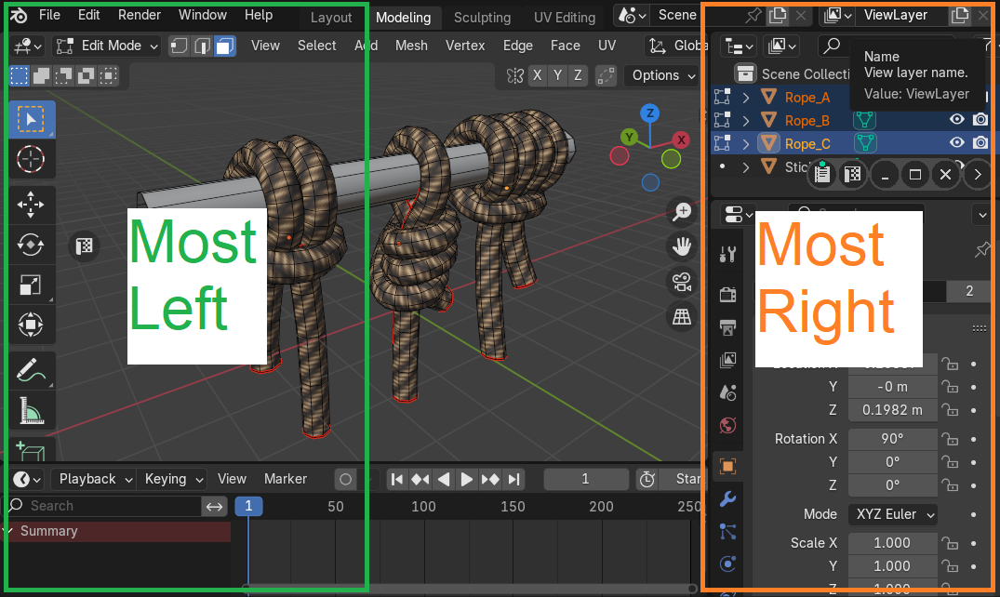

# Minimized Buttons
Minimize allows you to hide an area without closing it to the floating control bar until you Restore it.

## Minimize Mode
Defines the behaviour of the minimize button in control bar.

!!! Properties
    

### Manual
User selects where to restore minimized area.

|  |
|---|
| Manual area restore |

!!! Properties
    |  |
    |---|
    | Restore Selector |

#### Restore within Active Area

- Left
- Top
- Right
- Bottom

|  |
|---|
| |

#### Restore within Active Window

- Most Left
- Most Top
- Most Right
- Most Bottom

|  |
|---|
| |

|  |
|---|
| |

### Auto
Minimized area is restored automatically.

!!! Warning
    This mode can break your layout if there was more than 1 area minimized.

