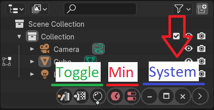

# System Buttons
Controls [areas](https://docs.blender.org/manual/en/latest/interface/window_system/areas.html) visibility

- Horizontal Split
- Vertical Split
- Minimize
- Maximize
- Close
- Expand-Collapse Bar

