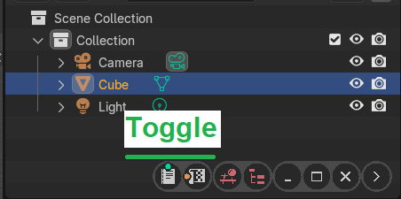
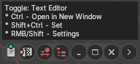
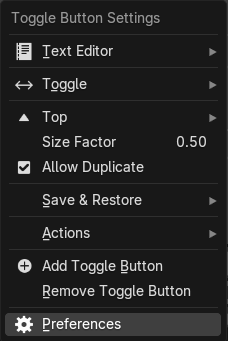
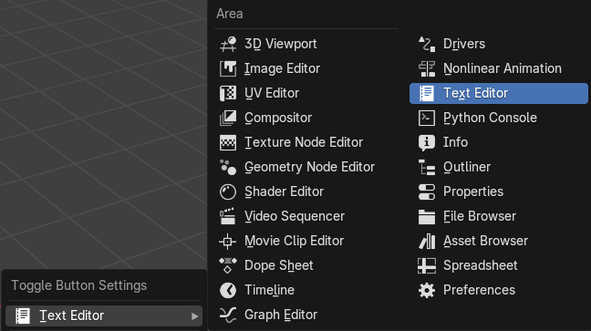
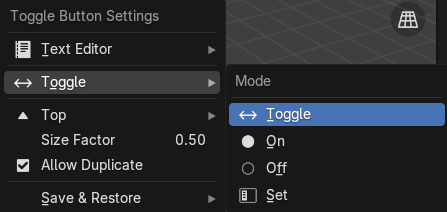
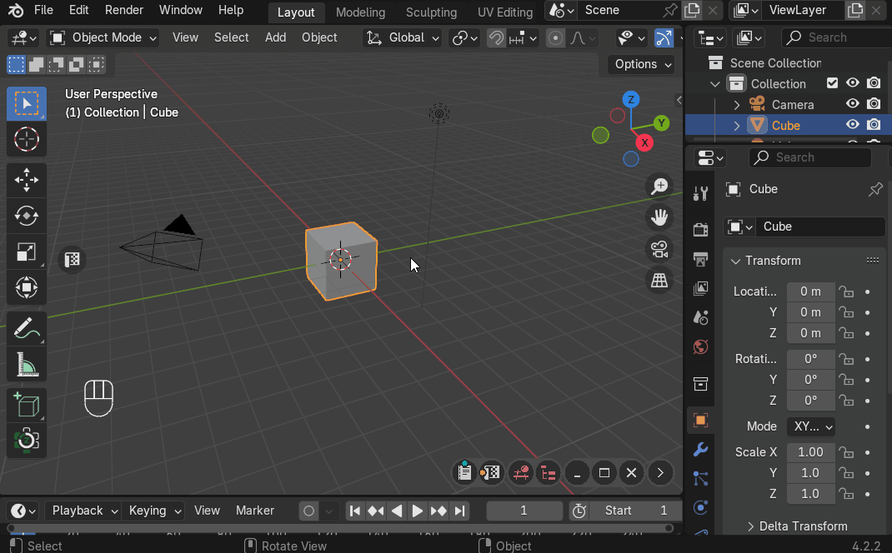
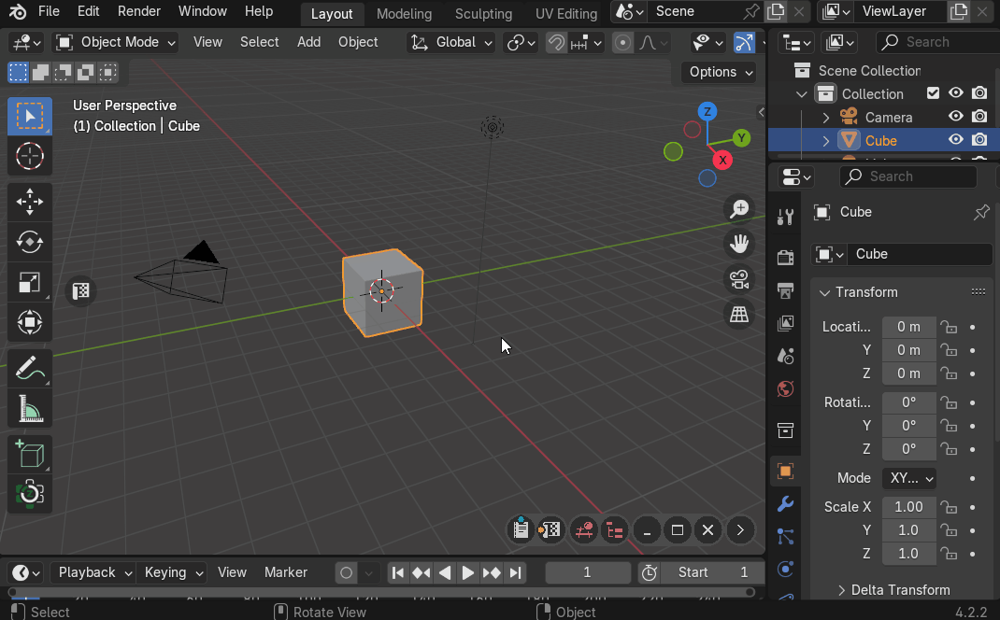
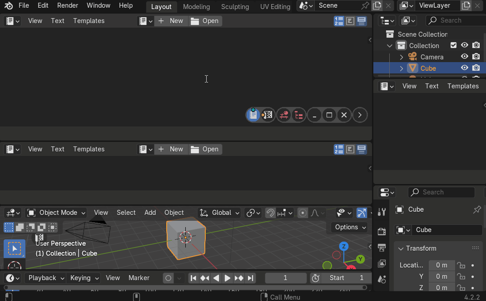
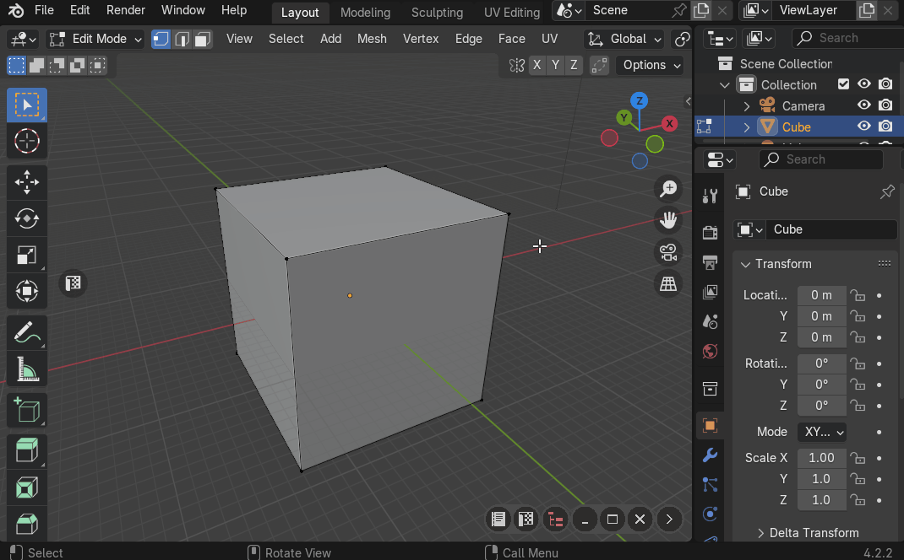

# Toggle Buttons
Allows to quickly toggle areas in viewport or open them in separate windows

|  |
|---|
| |

## Toggle Button Hint
Move a mouse over toggle button to get a hint be displayed. It will show what additional actions will be called by clicking on the button with the keymaps

|  |
|---|
| |

## Toggle Button Settings

|  |
|---|
| |

### Area Type

|  |
|---|
| |

### Mode
Toggle button works in one of the next available modes

|  |
|---|
| |

#### Toggle Mode
Toggle area with given area type

|  |
|---|
| |

!!! note
    If area duplicate is allowed, then new area will be created and this area will be closed

#### On Mode
Open area with given area type

|  |
|---|
| |

#### Off Mode
Close all areas with given area type

|  |
|---|
| |

#### Set Mode
Set type of active area with given area type

|  |
|---|
| |
