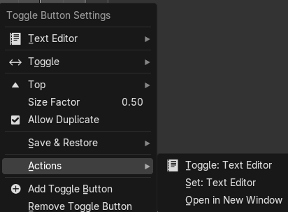
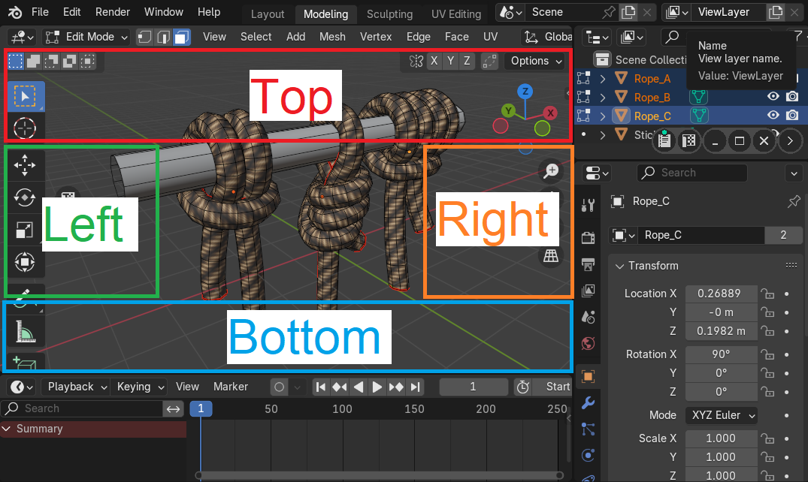
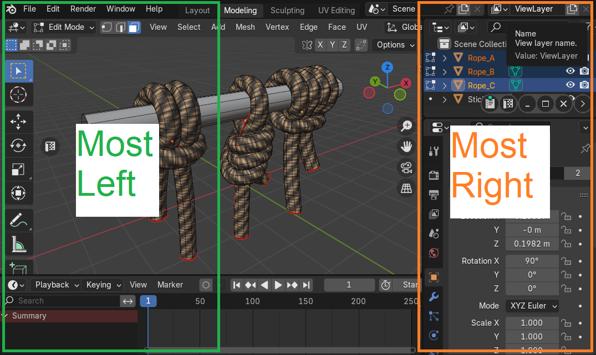
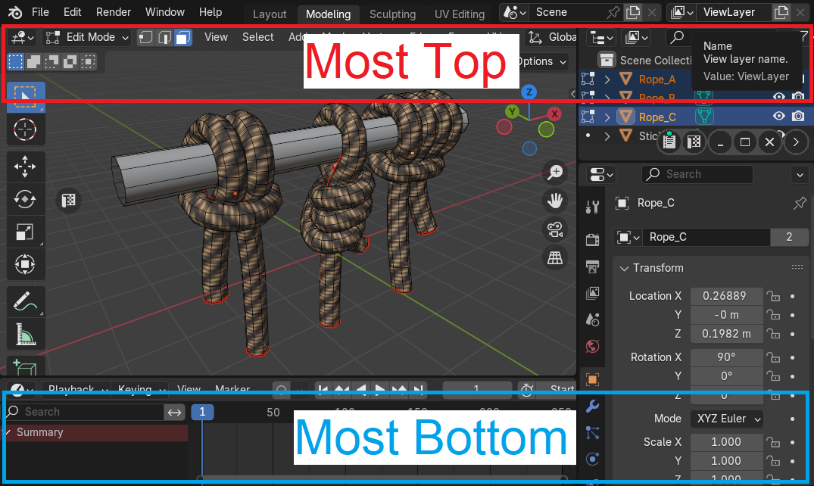
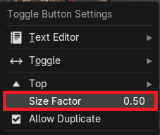
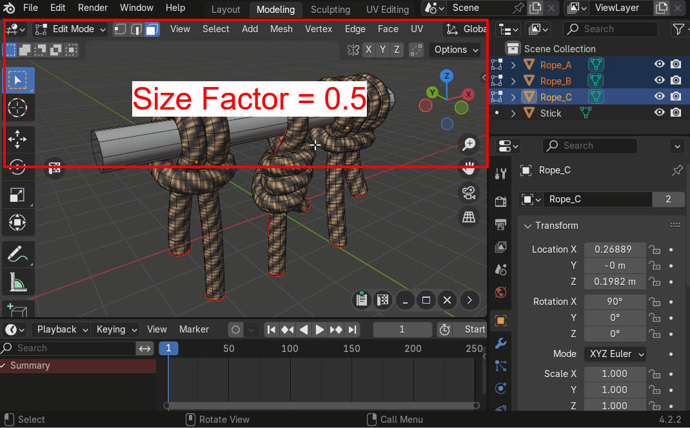
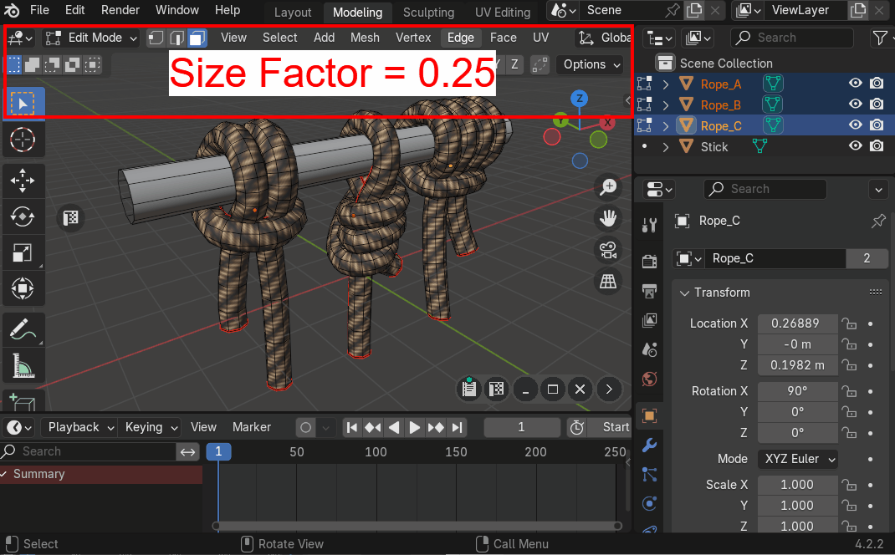
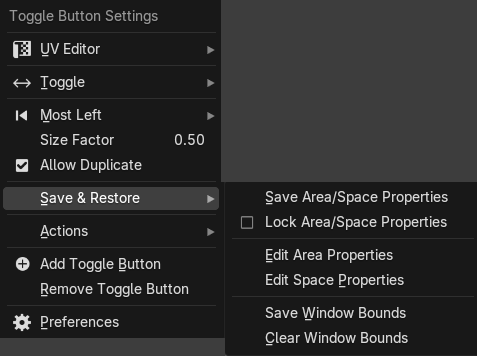

# Toggle Buttons
Allows to quickly toggle areas in viewport or open them in separate windows

|  |
|---|
| |

## Toggle Button Actions
There are actions that are associated with the toggle button, they could be called from popup menu or by clicking on the button with the usage of keymap sequences.

### Default Action - Click
Depends on button [mode](#mode):

* [Toggle](#toggle-mode)
* [On](#on-mode)
* [Off](#off-mode)
* [Set](#set-mode)

### Open In New Window - Ctrl + Click
Open new window and set area by given area type

### Set - Shift + Ctrl + Click
Set active area type by given area type

|  |
|---|
| Button actions hint |

### Actions Menu
Button actions are available in menu Actions

|  |
|---|
| Actions menu |

## Toggle Button Settings

|  |
|---|
| |

### Area Type

|  |
|---|
| |

### Mode
Toggle button works in one of the next available modes

|  |
|---|
| |

#### Toggle Mode
Toggle area with given area type

|  |
|---|
| |

!!! note
    If area duplicate is allowed, then new area will be created and this area will be closed

#### On Mode
Open area with given area type

|  |
|---|
| |

#### Off Mode
Close all areas with given area type

|  |
|---|
| |

#### Set Mode
Set type of active area with given area type

|  |
|---|
| |

### Direction
Indicates in which direction new area will be placed

#### Direction within Active Area

- Left
- Top
- Right
- Bottom

|  |
|---|
| |

#### Direction within Active Window

- Most Left
- Most Top
- Most Right
- Most Bottom

|  |
|---|
| |

|  |
|---|
| |

#### Size Factor
Size percentage of width or height depending on direction

|  |
|---|
| |

|  |
|---|
| |

|  |
|---|
| |

### Save and Restore Area and Space Properties
When new area is opened by default in Blender it has the default area and space settings. For example: UV Editor will have closed N-Panel and closed Toolbar Panel. Zen Dock addon gives an option to remember last area and space properties

|  |
|---|
| |
