# Toggle Buttons
Allows to:

- **manage areas** (quickly toggle areas in viewport or open them in separate windows)
- **execute python commands** (execute operators, call panels, menus, pie menus etc.)

|  |
|---|
| |

| 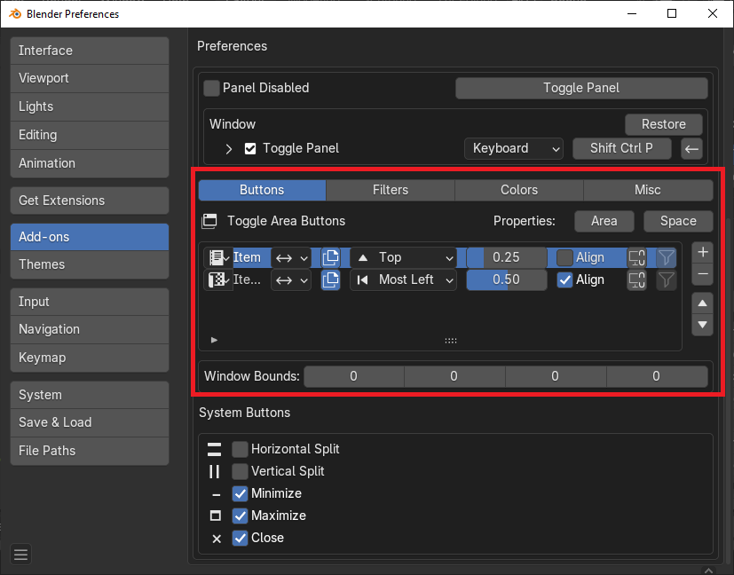 |
|---|
| List of toggle buttons in the Preferences |

## Toggle Button Actions
There are actions that are associated with the toggle button, they could be called from popup menu or by clicking on the button with the usage of keymap sequences.

### Default Action - Click
Depends on button [mode](#mode):

* [Toggle](#toggle-mode)
* [On](#on-mode)
* [Off](#off-mode)
* [Set](#set-mode)
* [Command](#command-mode)

| |
|---|
| Button actions hint |

### Open In New Window - Ctrl + Click
Open new window and set area by given area type

### Set - Shift + Ctrl + Click
[Set active area](#set-mode) type by given area type

### Actions Menu
Button actions are available in menu Actions

|  | 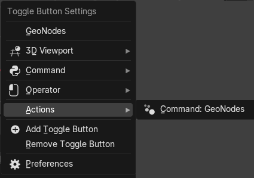 |
|---|---|
| Area management actions | Command button actions |

## Toggle Button Settings

|  | 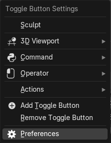  |
|---|---|
| Area management settings | Command button settings |

### Area Type

|  |
|---|
| |

### Mode
Toggle button works in one of the next available modes

|  |
|---|
| |

#### Toggle Mode
Toggle area with given area type

|  |
|---|
| |

!!! note
    If area duplicate is allowed, then new area will be created and this area will be closed

#### On Mode
Open area with given area type

|  |
|---|
| |

#### Off Mode
Close all areas with given area type

|  |
|---|
| |

#### Set Mode
Set type of active area with given area type

|  |
|---|
| |

### Command Mode
This mode allows to execute operators, call panels, menus, pie menus or custom scripts

#### Command
This field depends on [Command Type](#command-type)

| 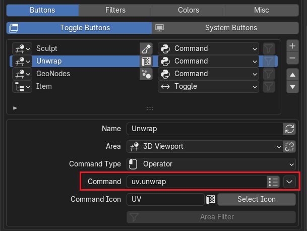 |
|---|
| Example of command for [Operator](#operator) [command type](#command-type) |

#### Command Type
Defines an action that will be done with command text

- [Operator](#operator)
    * [Execute python file](#execute-python-file)
    * [Execute text block](#execute-text-block)
- [Panel](#panel)
- [Menu](#menu)
- [Pie Menu](#pie-menu)
- [Script](#script)

##### Operator
Must be [a valid python command to call an operator](https://docs.blender.org/api/current/bpy.ops.html)

| 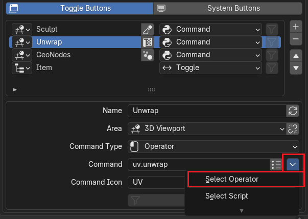 |
|---|
| Operator select menu |

###### Execute Python file
You can use Select Script wizzard to associate any python script located on disk with the button

| 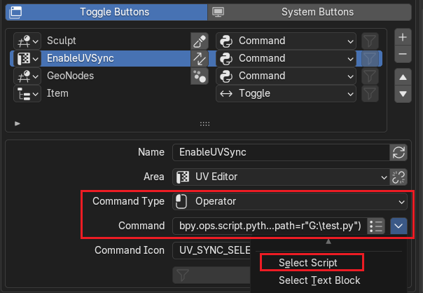 |
|---|
| Example of script associated with the button |

###### Execute Text Block
You can use Select Text Block wizzard to associate any script Text block with the button

| 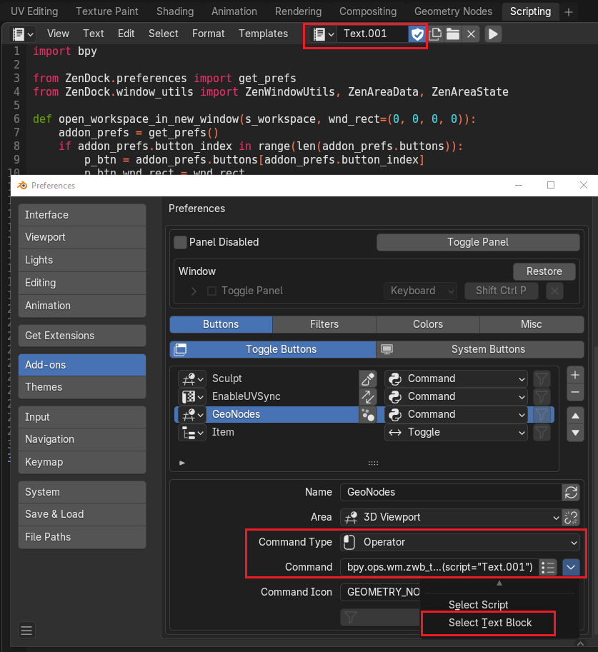 |
|---|
| Example of text block associated with the button |

##### Panel
Must be a valid python name of the existing panel in Blender python types API space

| 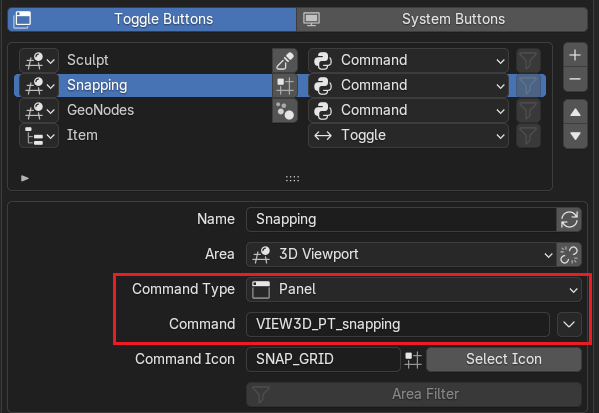 |
|---|
| Example of command for [Panel](#operator) [command type](#command-type) |

##### Menu
Must be a valid python name of the existing panel in Blender python types API space

| 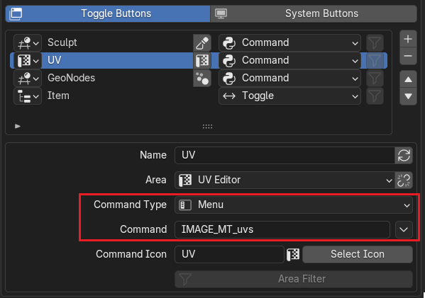 |
|---|
| Example of command for [Menu](#menu) [command type](#command-type) |

##### Pie Menu
Must be a valid python name of the existing panel in Blender python types API space

| 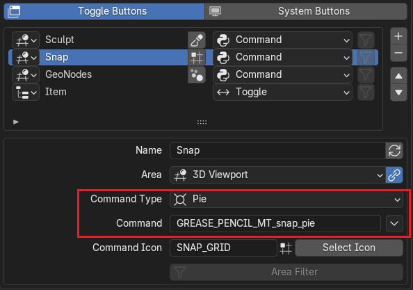 |
|---|
| Example of command for [Pie Menu](#pie-menu) [command type](#command-type) |

##### Script
Must be a valid chunk of python code

| 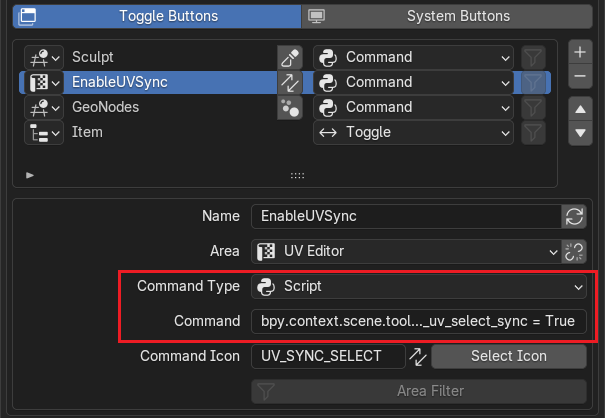 |
|---|
| Example of command for [Script](#script) [command type](#command-type) |

### Direction
Indicates in which direction new area will be placed

#### Direction within Active Area

- Left
- Top
- Right
- Bottom

|  |
|---|
| |

#### Direction within Active Window

- Most Left
- Most Top
- Most Right
- Most Bottom

|  |
|---|
| |

|  |
|---|
| |

#### Size Factor
Size percentage of width or height depending on direction

|  |
|---|
| |

|  |
|---|
| |

|  |
|---|
| |

### Save and Restore Area and Space Properties
When new area is opened by default in Blender it has the default area and space settings. For example: UV Editor will have closed N-Panel and closed Toolbar Panel. Zen Dock addon gives an option to remember last area and space properties

|  |
|---|
| |

#### Edit and Lock Properties
You can manuall edit area and space properties and lock its values. So every time new area properties will be assigned by fixed values

| 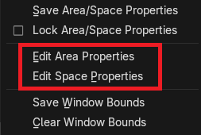 |
|---|
| Edit properties |

| 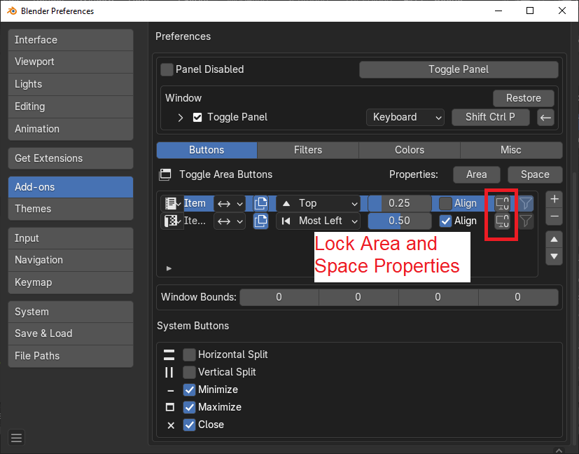 |
|---|
| Lock properties |

| 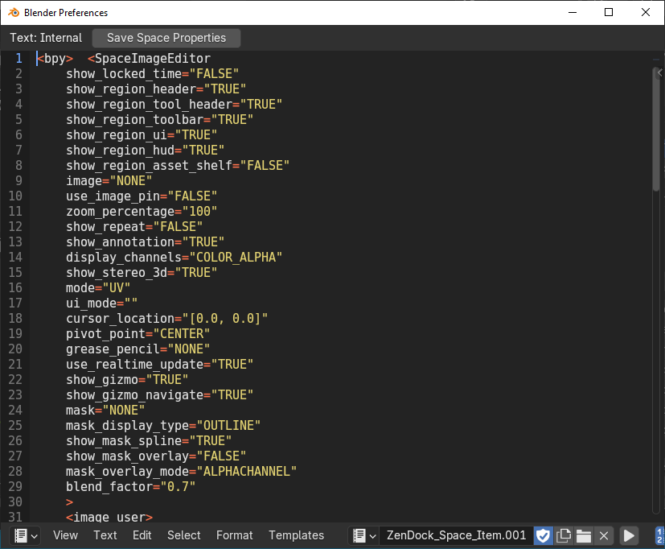 |
|---|
| Space properties editor window |
