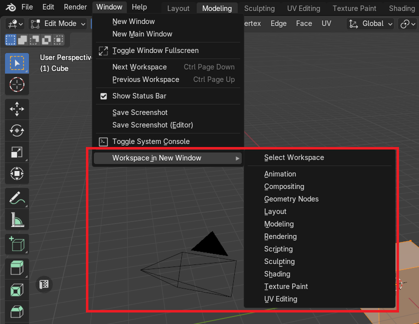
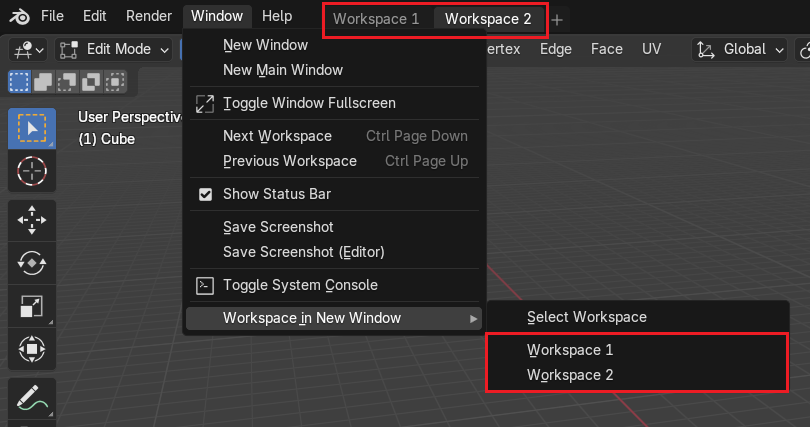
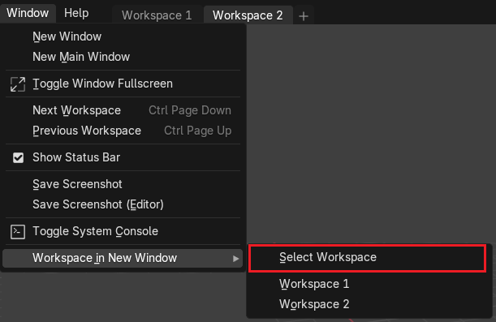
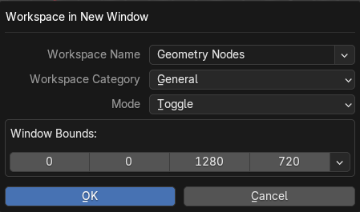
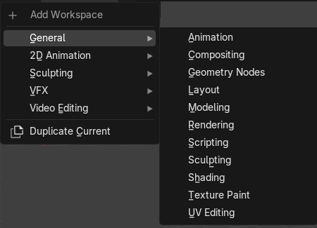
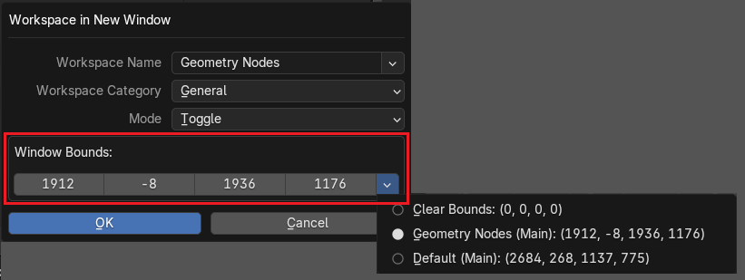

# Tools

## Open Workspace In a New Window
Operator to open or toggle workspace in a new window with an option for **Windows OS users** to specify window coordinates.

|  |
|---|
| |

### Current Blend Workspaces Presets
Set of workspaces that is saved in the current blend file can be quickly accessed to toggle in a new window via menu buttons.

|  |
|---|
| |

### Workspace In a New Window Options
You can select a workspace and adjust conditions for a hotkey.

|  |
|---|
| |

|  |
|---|
| |

#### Workspace Name
Must be a valid name of the existing workspace in the current blend file or in the one of the default layouts.

#### Workspace Category
Must be a valid category name that are shown during "Add Workspace" menu.

|  |
|---|
| Workspace name must match the name in the wizzard |

#### Mode
Defines the behaviour how to open workspace

##### Toggle Workspace
If workspace is already open in a window, the window will be closed.

##### Open Workspace
Always open new window with the corresponding workspace.

#### Window Bounds
Coordinates of the new window bounds (left, top, width, height) in absolute screen desktop pixel values.

!!! WARNING
    **This option is available only for Window OS users**

|  |
|---|
| |
